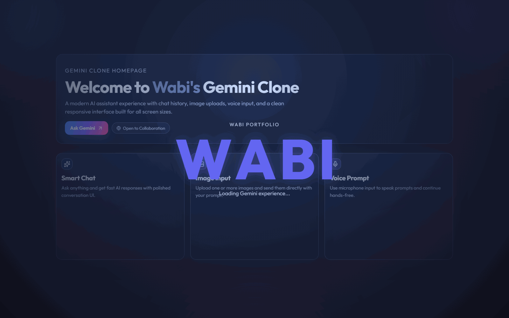
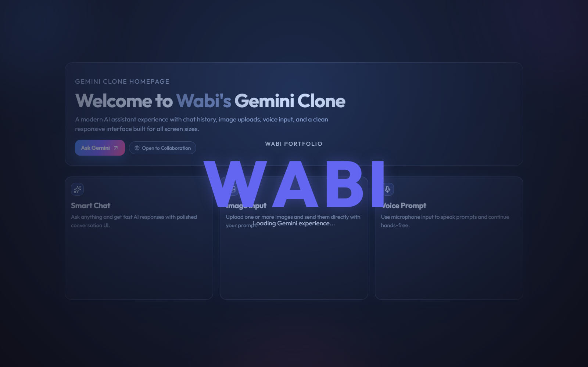
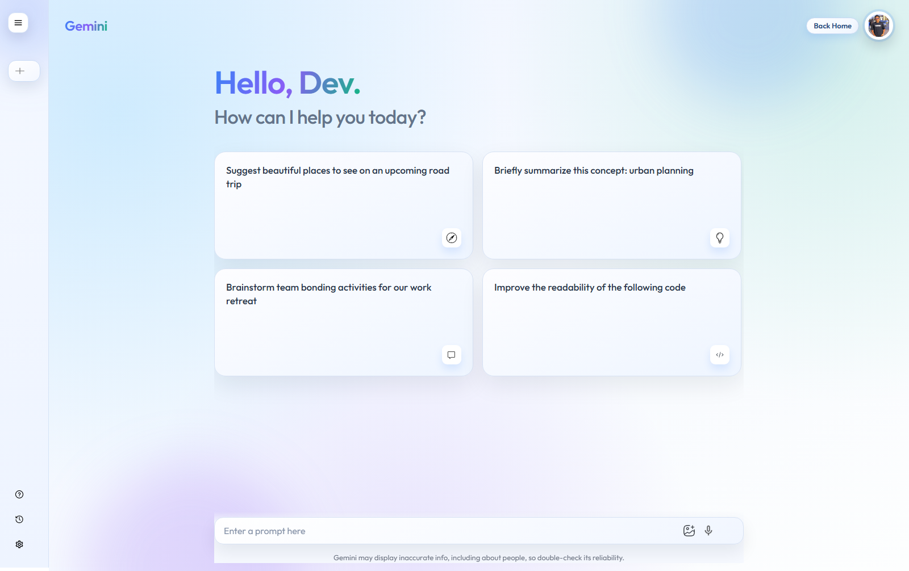
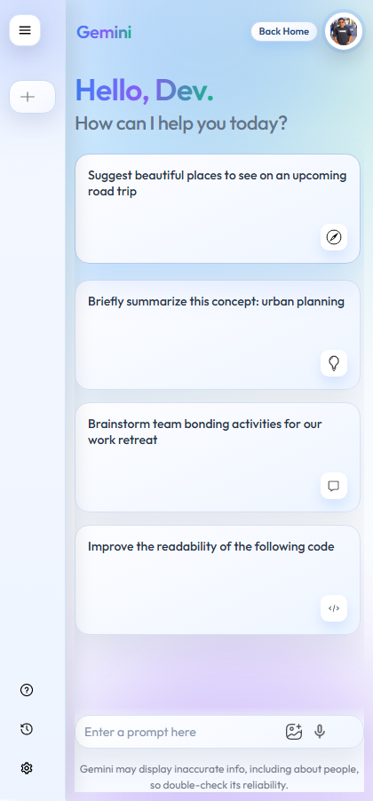

# Gemini Clone

A client-ready Gemini-inspired AI chat app built with React and Vite, showcasing production-style UX, multimodal prompts, and polished frontend execution for freelance delivery.

## What Problem This Solves

Most AI chat demos are either technically functional but visually generic, or visually attractive but missing practical UX features.

This project solves that gap by combining:

- Fast conversational AI flow with multimodal prompts (text + image)
- Practical daily-use UX (prompt history, retry, copy response, voice input)
- Portfolio-quality interface and transitions that feel product-ready

## My Role / Contributions

I built this project end-to-end as a solo frontend implementation, including:

- UI architecture and responsive layout (desktop + mobile)
- Conversation state management with React Context
- Gemini API integration with model fallback strategy and error handling
- Multimodal image upload and preview pipeline (base64 + inline data)
- Voice input using browser Speech Recognition API
- Prompt history persistence with localStorage
- Portfolio-focused polishing (interaction states, loading, retry, copy flow)

## Preview

### Demo Flow (GIF)



### 1) Home Dashboard



### 2) Chat Interface



### 3) Mobile Responsive View



## Tech Stack

- React 19
- Vite 8
- Google Generative AI SDK (`@google/generative-ai`)
- Framer Motion
- Lucide React
- Netlify (deployment target)

## Features

- Gemini-style conversational interface
- Prompt history persisted in local storage
- Image upload and preview before sending prompts
- Voice input support (browser Speech Recognition API)
- Retry + copy response actions
- Responsive layout for desktop and mobile
- Animated landing and transition experience

## Local Setup

1. Install dependencies.

```bash
npm install
```

2. Create a `.env` file in the project root.

```env
VITE_GEMINI_API_KEY=your_gemini_api_key_here
```

3. Start the development server.

```bash
npm run dev
```

4. Build for production.

```bash
npm run build
```

## Environment Variables

Required variables:

- `VITE_GEMINI_API_KEY`: Google Gemini API key used by the frontend client.

See `.env.example` for a template.

## Deployment / Live Demo

- Live demo: `Add your deployed URL here`
- Recommended hosting: Netlify
- Build command: `npm run build`
- Publish directory: `dist`

The repo includes SPA redirect rules in `netlify.toml`.

## Future Improvements

- Add streaming response rendering
- Add Markdown rendering with a vetted sanitizer
- Add test coverage for context and prompt workflows
- Add accessibility audit and keyboard navigation refinements
